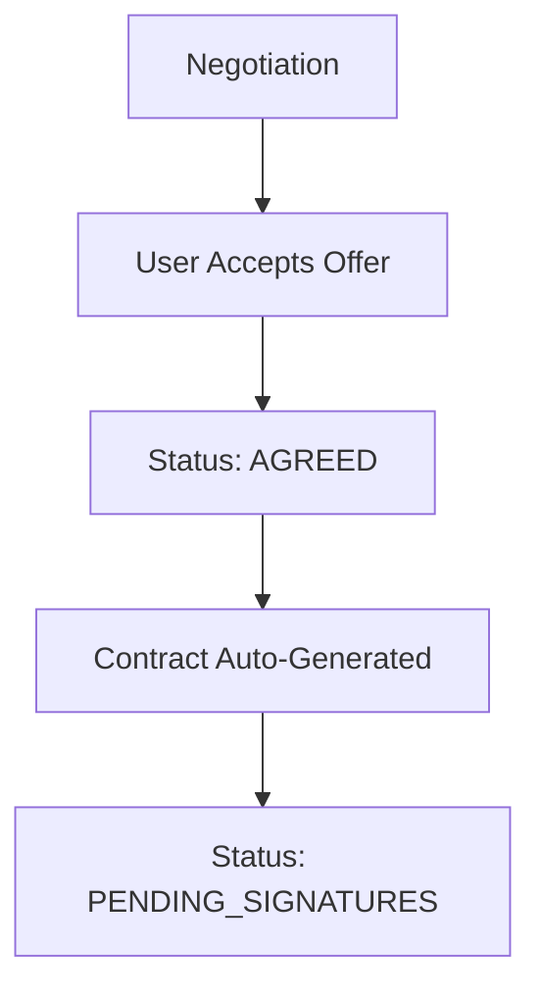
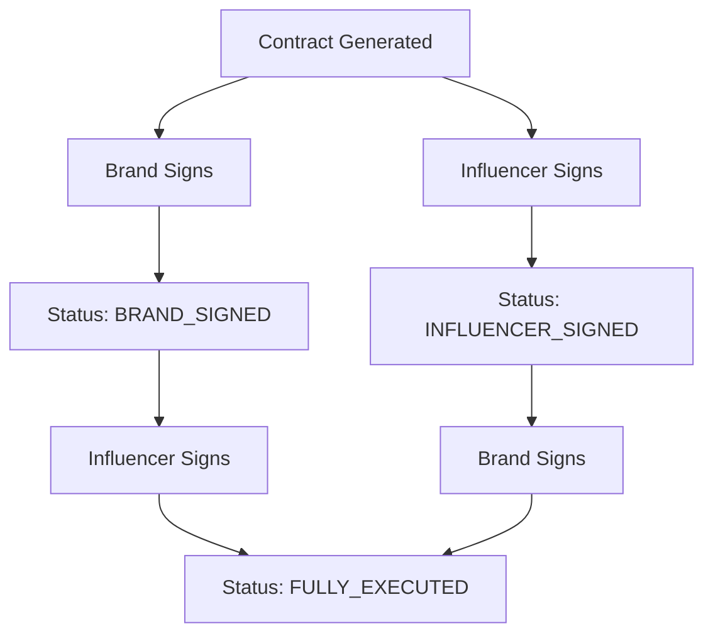

# InfluencerFlow Contract Generation System

## 🎯 Overview

The InfluencerFlow Backend now includes a complete **Digital Contract Generation and Signing System** that automatically creates, manages, and executes contracts when negotiations reach an agreement.

## ✨ Key Features

### 🤖 Automatic Contract Generation
- **Trigger**: Contracts are automatically generated when negotiation status reaches "AGREED"
- **Content**: Comprehensive contract terms derived from negotiation details
- **Legal Compliance**: Includes standard legal clauses, dispute resolution, and governing law
- **Currency Support**: Multi-currency contract generation with proper formatting

### 🖊️ Digital Signature System
- **Dual Signatures**: Both brand and influencer can digitally sign contracts
- **Legal Validity**: Captures IP address, user agent, and timestamp for each signature
- **Sequential Signing**: Supports any signing order (brand first, influencer first, or simultaneous)
- **Status Tracking**: Real-time contract status updates through the signing process

### 📄 Professional Contract Documents
- **HTML Generation**: Beautiful, printable contract documents
- **Comprehensive Content**: Includes all deliverables, pricing, terms, and conditions
- **Signature Display**: Shows digital signature status and details
- **Professional Layout**: Industry-standard contract formatting

### 🔌 Complete API Integration
- **RESTful Endpoints**: Full CRUD operations for contract management
- **Frontend Ready**: Properly formatted responses for UI integration
- **Error Handling**: Comprehensive error handling with meaningful messages
- **Status Monitoring**: Real-time contract and signature status endpoints

## 🏗️ Architecture

### Core Components

#### 1. ContractGenerationService
**File**: `app/services/contract_service.py`
- Contract generation from negotiation terms
- Digital signature management
- HTML contract rendering
- Contract lifecycle management

#### 2. Contract API
**File**: `app/api/contracts.py`
- RESTful endpoints for contract operations
- Request/response validation
- Authentication integration ready

#### 3. Enhanced Models
**File**: `app/models/negotiation_models.py`
- `ContractTerms` dataclass with comprehensive contract data
- `DigitalSignature` dataclass for signature tracking
- `ContractStatus` enum for status management

#### 4. Conversation Handler Integration
**File**: `app/services/conversation_handler.py`
- Automatic contract generation on agreement
- Contract details included in acceptance messages

## 📋 API Endpoints

### Contract Management
```http
GET /api/contracts/{contract_id}                    # Get contract details
GET /api/contracts/session/{session_id}             # Get contract by session
GET /api/contracts/{contract_id}/view                # Get HTML contract
POST /api/contracts/{contract_id}/sign               # Digital signature
GET /api/contracts/{contract_id}/status              # Get signature status  
GET /api/contracts/                                  # List all contracts
```

### Request/Response Examples

#### Get Contract Details
```bash
curl -X GET "http://localhost:8000/api/contracts/{contract_id}"
```

**Response:**
```json
{
  "contract_id": "abc123-def456",
  "status": "fully_executed",
  "brand_name": "Tech Innovations Inc",
  "influencer_name": "Sarah Johnson",
  "campaign_title": "Product Launch Campaign",
  "total_amount": 1500.0,
  "currency": "USD",
  "signatures": {
    "brand_signed": true,
    "influencer_signed": true
  },
  "created_date": "2025-05-31T10:30:00Z"
}
```

#### Digital Signature
```bash
curl -X POST "http://localhost:8000/api/contracts/{contract_id}/sign" \
-H "Content-Type: application/json" \
-d '{
  "signer_type": "brand",
  "signer_name": "John Marketing Director", 
  "signer_email": "john@techinnovations.com"
}'
```

**Response:**
```json
{
  "message": "Contract successfully signed by brand",
  "contract_id": "abc123-def456",
  "status": "brand_signed",
  "fully_executed": false,
  "signatures": {
    "brand_signed": true,
    "influencer_signed": false
  }
}
```

## 🔄 Contract Workflow

### 1. Automatic Generation


### 2. Digital Signing Process


### 3. Contract Lifecycle
- **PENDING_SIGNATURES**: Contract generated, awaiting signatures
- **BRAND_SIGNED**: Brand has signed, waiting for influencer
- **INFLUENCER_SIGNED**: Influencer has signed, waiting for brand  
- **FULLY_EXECUTED**: Both parties signed, contract active
- **CANCELLED**: Contract cancelled (if needed)

## 💾 Data Models

### ContractTerms
```python
@dataclass
class ContractTerms:
    contract_id: str
    session_id: str
    brand_name: str
    brand_contact_email: str
    brand_contact_name: str
    influencer_name: str
    influencer_email: str
    influencer_contact: str
    
    # Campaign Details
    campaign_title: str
    campaign_description: str
    deliverables: List[ContentDeliverable]
    total_amount: float
    currency: str
    payment_terms: str
    campaign_start_date: datetime
    campaign_end_date: datetime
    
    # Legal Terms
    usage_rights: str
    exclusivity_period_days: Optional[int]
    revisions_included: int
    cancellation_policy: str
    dispute_resolution: str
    governing_law: str
    
    # Contract Metadata
    contract_date: datetime
    status: ContractStatus
    brand_signature: Optional[DigitalSignature]
    influencer_signature: Optional[DigitalSignature]
    contract_version: str
```

### DigitalSignature
```python
@dataclass
class DigitalSignature:
    signer_name: str
    signer_email: str
    signature_timestamp: datetime
    ip_address: str
    user_agent: str
    signature_id: str
```

## 🧪 Testing

### Automated Tests
- **Unit Tests**: `test_contract_system_pytest.py`
  - Contract generation validation
  - Digital signing process
  - HTML generation
  - API compatibility

- **Integration Tests**: `test_contract_integration.py`
  - End-to-end workflow testing
  - API endpoint validation
  - Real server integration

### Running Tests
```bash
# Unit tests
python -m pytest test_contract_system_pytest.py -v

# Integration tests (requires running server)
python test_contract_integration.py
```

## 🔧 Configuration

### Dependencies Added
```text
jinja2==3.1.4  # For HTML template rendering
```

### Environment Setup
No additional environment variables required. The contract system uses the existing application configuration.

## 🚀 Usage Examples

### 1. Basic Integration
```python
from app.services.contract_service import contract_service

# Generate contract from negotiation
contract = contract_service.generate_contract(
    session_id="session123",
    negotiation_state=negotiation,
    brand_contact_email="legal@brand.com",
    brand_contact_name="Legal Team",
    influencer_contact="+1-555-0123"
)

# Sign contract
signed_contract = contract_service.sign_contract(
    contract_id=contract.contract_id,
    signer_type="brand",
    signer_name="John Doe",
    signer_email="john@brand.com",
    ip_address="192.168.1.1",
    user_agent="Mozilla/5.0..."
)
```

### 2. Frontend Integration
```javascript
// Get contract details
const contract = await fetch(`/api/contracts/${contractId}`);
const contractData = await contract.json();

// Sign contract
const signature = await fetch(`/api/contracts/${contractId}/sign`, {
  method: 'POST',
  headers: { 'Content-Type': 'application/json' },
  body: JSON.stringify({
    signer_type: 'influencer',
    signer_name: 'Jane Smith',
    signer_email: 'jane@influencer.com'
  })
});
```

## 📊 Benefits

### For Businesses
- **Automated Workflow**: Reduces manual contract creation time
- **Legal Compliance**: Standard legal terms and conditions
- **Digital Efficiency**: Eliminate paper-based processes
- **Audit Trail**: Complete signature tracking and verification

### For Influencers  
- **Professional Process**: Industry-standard contract management
- **Digital Convenience**: Sign contracts from anywhere
- **Transparent Terms**: Clear, readable contract format
- **Secure Signatures**: Legally valid digital signatures

### For Developers
- **API-First Design**: Easy frontend integration
- **Comprehensive Endpoints**: Full contract lifecycle management
- **Type Safety**: Strong typing with Pydantic models
- **Extensible**: Easy to add new contract features

## 🔮 Future Enhancements

### Planned Features
- **PDF Generation**: Convert HTML contracts to PDF
- **Email Integration**: Automatic contract delivery via email
- **Reminder System**: Signature deadline notifications
- **Contract Templates**: Customizable contract templates
- **Blockchain Integration**: Immutable contract storage
- **Advanced Analytics**: Contract performance metrics

### Integration Opportunities
- **DocuSign**: Professional e-signature service integration
- **Legal Review**: Attorney approval workflow
- **Payment Integration**: Automatic payment upon signature
- **CRM Integration**: Contract data synchronization

## 📚 Technical Notes

### Security Considerations
- **Signature Verification**: IP address and user agent tracking
- **Data Validation**: Comprehensive input validation
- **Access Control**: Ready for authentication integration
- **Audit Logging**: Complete action history tracking

### Performance
- **Memory Management**: Efficient contract storage
- **Concurrent Signing**: Thread-safe signature processing
- **Caching**: Contract data caching for performance
- **Scalability**: Designed for high-volume usage

### Maintenance
- **Error Handling**: Comprehensive error management
- **Logging**: Detailed operation logging
- **Monitoring**: Built-in status monitoring
- **Backup**: Contract data persistence

---

## 🎉 Summary

The InfluencerFlow Contract Generation System provides a complete, production-ready solution for digital contract management in influencer marketing campaigns. It seamlessly integrates with the existing negotiation system to automatically generate, manage, and execute contracts with full digital signature support.

**Key Achievements:**
✅ Automatic contract generation from negotiations  
✅ Complete digital signature workflow  
✅ Professional HTML contract documents  
✅ Full REST API for frontend integration  
✅ Comprehensive test coverage  
✅ Production-ready error handling  
✅ Legal compliance features  
✅ Multi-currency support  

The system is now ready for production deployment and frontend integration!
